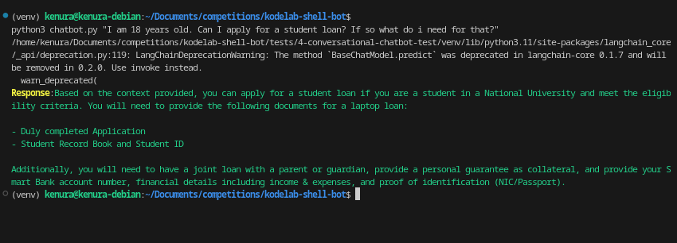

# Kodelabs - IntelliHack NextGen



### Create a Virtual Environment

```bash
python3 -m venv venv
```

### Activate the Virtual Environment

```bash
source venv/bin/activate
```

## Install Dependencies

```bash
pip install -r requirements.txt
```

## Setup Chatbot using markdown file.

Create the Chroma DB.

```bash
python3 setup.py
```

## Start Chatbot

```bash
python3 chatbot.py "I am 18 years old. Can I apply for a student loan? If so what do i need for that?"
```

Please put a OpenAI API key.
